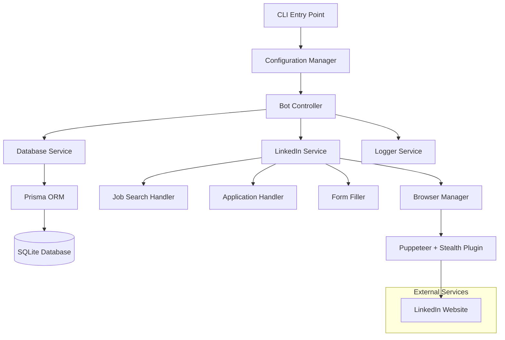

# Design Document

## Overview

The LinkedIn Job Application Automation Bot is a Node.js application that uses Puppeteer to automate job applications on LinkedIn. The system follows a modular architecture with TypeScript for type safety, Prisma ORM for database operations, and implements stealth techniques to avoid detection. The bot focuses on "Easy Apply" jobs and maintains a comprehensive database of applications to prevent duplicates.

## Architecture

### High-Level Architecture



### Technology Stack

- **Runtime**: Node.js with TypeScript for type safety and better development experience
- **Browser Automation**: Puppeteer with puppeteer-extra-plugin-stealth for detection avoidance
- **Database**: SQLite with Prisma ORM for simple, file-based data persistence
- **Configuration**: JSON-based configuration with validation
- **Logging**: Custom logging service with multiple levels and file output

## Components and Interfaces

### Core Interfaces

```typescript
// src/types/index.ts
export interface JobSearchConfig {
  keywords: string[];
  location: string;
  datePosted: 'past24h' | 'pastWeek' | 'pastMonth' | 'any';
  remoteWork: boolean;
  experienceLevel: string[];
  jobType: string[];
}

export interface ApplicationConfig {
  personalInfo: {
    experience: string;
    salaryExpectation: {
      min: number;
      max: number;
      currency: string;
    };
  };
  commonAnswers: Record<string, string>;
}

export interface BotConfig {
  linkedin: {
    email: string;
    password: string;
  };
  search: JobSearchConfig;
  application: ApplicationConfig;
  browser: {
    headless: boolean;
    slowMo: number;
    timeout: number;
  };
  delays: {
    minPageLoad: number;
    maxPageLoad: number;
    minTyping: number;
    maxTyping: number;
  };
}

export interface JobPosting {
  id: string;
  title: string;
  company: string;
  location: string;
  url: string;
  description?: string;
  appliedAt?: Date;
  status: 'found' | 'applied' | 'skipped' | 'error';
}
```

### Component Structure

#### 1. Configuration Manager (`src/config/`)
- **ConfigLoader**: Loads and validates configuration from config.json
- **ConfigValidator**: Validates configuration schema and required fields
- **DefaultConfig**: Provides default configuration template

#### 2. Database Service (`src/database/`)
- **DatabaseService**: Wrapper around Prisma client
- **JobRepository**: CRUD operations for job postings
- **ApplicationRepository**: Tracks application history and statistics

#### 3. Browser Manager (`src/browser/`)
- **BrowserManager**: Manages Puppeteer browser lifecycle
- **StealthSetup**: Configures stealth plugin and anti-detection measures
- **SessionManager**: Handles LinkedIn login and session persistence

#### 4. LinkedIn Service (`src/linkedin/`)
- **LinkedInService**: Main orchestrator for LinkedIn interactions
- **JobSearchHandler**: Handles job search and filtering
- **ApplicationHandler**: Manages the application process
- **FormFiller**: Automatically fills application forms
- **CaptchaHandler**: Detects and manages CAPTCHA challenges

#### 5. Utilities (`src/utils/`)
- **Logger**: Comprehensive logging with file and console output
- **DelayUtils**: Random delay generation for human-like behavior
- **SelectorUtils**: Backup selectors and element detection
- **ErrorHandler**: Centralized error handling and recovery

## Data Models

### Prisma Schema

```prisma
// prisma/schema.prisma
generator client {
  provider = "prisma-client-js"
}

datasource db {
  provider = "sqlite"
  url      = "file:./jobs.db"
}

model JobPosting {
  id          String   @id
  title       String
  company     String
  location    String
  url         String   @unique
  description String?
  salary      String?
  appliedAt   DateTime?
  status      String   // 'found', 'applied', 'skipped', 'error'
  createdAt   DateTime @default(now())
  updatedAt   DateTime @updatedAt

  @@map("job_postings")
}

model ApplicationSession {
  id            String   @id @default(cuid())
  startedAt     DateTime @default(now())
  endedAt       DateTime?
  jobsFound     Int      @default(0)
  jobsApplied   Int      @default(0)
  jobsSkipped   Int      @default(0)
  errors        Int      @default(0)
  status        String   // 'running', 'completed', 'failed'

  @@map("application_sessions")
}
```

## Error Handling

### Error Categories

1. **Configuration Errors**: Invalid or missing configuration
2. **Authentication Errors**: LinkedIn login failures
3. **Network Errors**: Connection timeouts and network issues
4. **Parsing Errors**: Unable to extract job information
5. **Application Errors**: Form submission failures
6. **Detection Errors**: Bot detection by LinkedIn

### Error Recovery Strategies

```typescript
// src/utils/ErrorHandler.ts
export class ErrorHandler {
  static async handleWithRetry<T>(
    operation: () => Promise<T>,
    maxRetries: number = 3,
    backoffMs: number = 1000
  ): Promise<T> {
    // Exponential backoff retry logic
  }

  static handleCaptcha(): Promise<void> {
    // Pause execution and wait for manual intervention
  }

  static handleSessionExpired(): Promise<void> {
    // Attempt re-authentication
  }
}
```

## Testing Strategy

### Unit Testing
- **Configuration validation**: Test config loading and validation
- **Database operations**: Test CRUD operations with in-memory SQLite
- **Form filling logic**: Test form field detection and filling
- **Delay utilities**: Test random delay generation within bounds

### Integration Testing
- **LinkedIn login flow**: Test authentication with test credentials
- **Job search functionality**: Test search parameter application
- **Application process**: Test end-to-end application flow with mock jobs
- **Database persistence**: Test job storage and duplicate detection

### End-to-End Testing
- **Complete automation flow**: Test full bot execution with limited scope
- **Error scenarios**: Test CAPTCHA handling and network failures
- **Session management**: Test long-running sessions and recovery

### Test Structure

```typescript
// tests/unit/FormFiller.test.ts
describe('FormFiller', () => {
  test('should fill experience field correctly', async () => {
    // Test form filling logic
  });

  test('should handle missing form fields gracefully', async () => {
    // Test error handling
  });
});

// tests/integration/LinkedInService.test.ts
describe('LinkedInService Integration', () => {
  test('should login successfully with valid credentials', async () => {
    // Test authentication flow
  });

  test('should search jobs with filters', async () => {
    // Test job search functionality
  });
});
```

### Mock Strategy
- **LinkedIn pages**: Use Puppeteer's page.setContent() for testing form interactions
- **Database**: Use in-memory SQLite for fast test execution
- **Network requests**: Mock external API calls and network delays

## Security Considerations

### Anti-Detection Measures
1. **Stealth Plugin**: Use puppeteer-extra-plugin-stealth to mask automation signatures
2. **Human-like Behavior**: Random delays, realistic typing speeds, mouse movements
3. **Session Management**: Proper cookie handling and session persistence
4. **Rate Limiting**: Configurable delays between applications

### Data Protection
1. **Credential Security**: Secure storage of LinkedIn credentials
2. **Local Storage**: All data stored locally in SQLite database
3. **Logging**: Sensitive information excluded from logs
4. **Configuration**: Separate sensitive config from code repository

### Compliance
1. **Terms of Service**: Clear documentation about LinkedIn ToS compliance
2. **Rate Limiting**: Respectful automation that doesn't overload LinkedIn servers
3. **User Consent**: Clear indication that this is an automation tool
4. **Data Handling**: Transparent about what data is collected and stored
